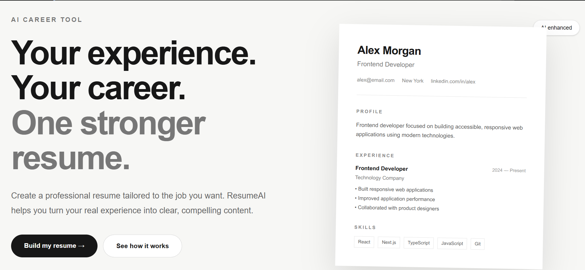

# ResumeAI — Your Experience. Your Career. One Stronger Resume.

**Build a stronger resume. Stand out to employers. Take the next step in your career.**

ResumeAI is an AI-powered resume builder designed to help job seekers turn their experience, skills, and achievements into professional, ATS-friendly resumes. With multiple templates, AI-powered writing assistance, secure resume storage, and PDF export, ResumeAI makes resume creation simpler and more accessible.

 **Live Demo:** [Try ResumeAI](https://resume-builder-ai-opal.vercel.app/)  
 **GitHub Repository:** [resume-builder-ai](https://github.com/hadya12muska/resume-builder-ai)

---
##  Resume-Builder-AI Homepage



**Build professional, ATS-friendly resumes with AI assistance.**

 [Visit ResumeAI](https://resume-builder-ai-opal.vercel.app/)
##  Why ResumeAI?

Creating a resume shouldn't be complicated. ResumeAI combines a clean, modern interface with practical tools to help you create, improve, save, and download your resume in one place.

Whether you're applying for your first job, looking for an internship, or preparing for your next career move, ResumeAI helps you present your experience with confidence.

##  Features

-  AI-Powered Resume Improvement — Improve resume wording with AI assistance while preserving your real experience and qualifications.
-  Multiple Resume Templates — Choose from a variety of layouts designed for different career paths and professional styles.
-  ATS-Friendly Formatting — Create clean, structured resumes designed with applicant tracking system readability in mind.
-  Profile Photo Support — Upload or remove a profile photo when building your resume.
-  Save and Edit Resumes — Store your resumes and return to update them later.
-  PDF Export — Download your finished resume as a PDF.
-  User Authentication — Sign up and sign in to access your account.
-  Modern User Interface — Enjoy a clean, career-focused design built with a responsive web framework.

##  Built With

| Technology | Purpose |
|---|---|
| [Next.js](https://nextjs.org/) | Full-stack React framework |
| [React](https://react.dev/) | Interactive user interface |
| [TypeScript](https://www.typescriptlang.org/) | Type-safe development |
| [Tailwind CSS](https://tailwindcss.com/) | Styling and responsive layouts |
| [Supabase](https://supabase.com/) | Authentication and database |
| [OpenRouter](https://openrouter.ai/) | AI-powered resume improvement |
| [Vercel](https://vercel.com/) | Deployment and hosting |

##  How It Works

1. **Create an account** — Sign up to access your resume workspace.
2. **Choose a template** — Select a layout that suits your career goals.
3. **Add your information** — Enter your profile, education, experience, and skills.
4. **Improve your content** — Use AI assistance to make your writing clearer and more professional.
5. **Save your resume** — Keep your work available for future editing.
6. **Download your PDF** — Get a resume ready to review and use in job applications.

##  Run Locally

Want to explore the code or contribute? Follow these steps.

### Prerequisites

- Node.js and npm
- A Supabase project
- An OpenRouter API key for AI improvement

### Installation

**1. Clone the repository**

```bash
git clone https://github.com/hadya12muska/resume-builder-ai.git
cd resume-builder-ai
```

**2. Install dependencies**

```bash
npm install
```

**3. Configure environment variables**

Create a `.env.local` file in the project's root directory:

```env
NEXT_PUBLIC_SUPABASE_URL=your_supabase_project_url
NEXT_PUBLIC_SUPABASE_PUBLISHABLE_KEY=your_supabase_publishable_key
OPENROUTER_API_KEY=your_openrouter_api_key
```

Replace the example values with your own credentials. Never commit `.env.local` or expose secret API keys publicly.

**4. Start the development server**

```bash
npm run dev
```

**5. Open the application**

Visit [http://localhost:3000](http://localhost:3000) in your browser.

##  Security

- Keep API keys and credentials out of source control.
- Store private API keys in server-side environment variables.
- Configure Supabase authentication and database access policies appropriately.
- Never commit `.env.local` to the repository.

##  Project Vision

ResumeAI aims to make professional resume creation easier by combining accessible design, reusable templates, and AI writing assistance.

Future improvements could include additional templates, more customization options, stronger resume feedback, and expanded career-building tools.

##  Contributing

Ideas, bug reports, and improvements are welcome!

1. Fork the repository.
2. Create a branch for your changes.
3. Make your changes and test them.
4. Submit a pull request describing your contribution.

##  License

No license has been specified yet. All rights remain with the copyright holder unless a license is added to this repository.

---

**ResumeAI — Make your next application your strongest one.**

*Built with Next.js, TypeScript, Supabase, and OpenRouter.*
